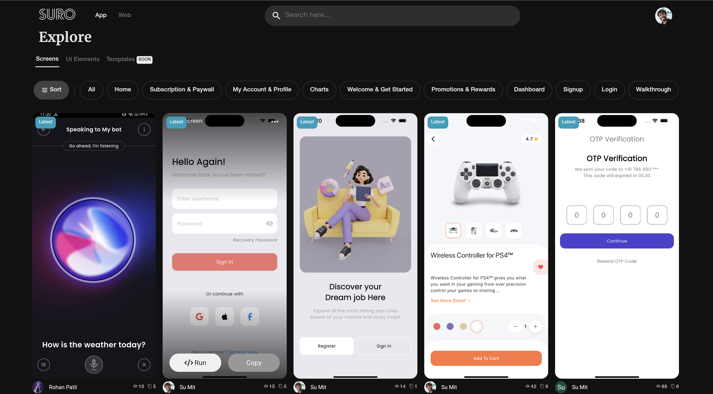
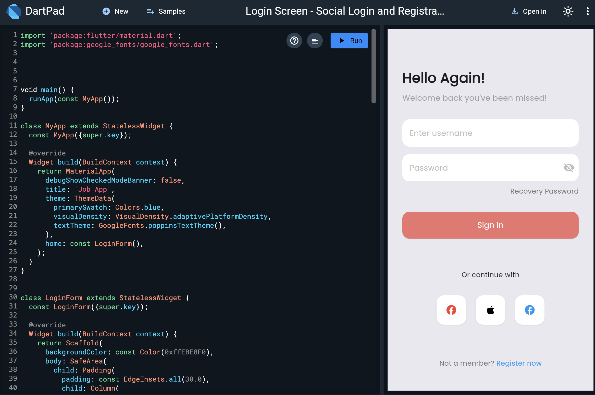

# Suro - Flutter Showcase Platform

Suro is a platform for Flutter developers to showcase, share, and explore UI designs, animations, and components. Think of it as Dribbble for Flutter—a vibrant community where developers can inspire and learn from each other's work.

## 🎥 See Suro in Action
  

## 🌟 Features

- **Upload Your Work**: Share screenshots of your screens along with the corresponding code.
- **Instant Code Access**: Other developers can easily copy or run the code with just a click.
- **Online Code Execution**: Run and test Flutter code directly in the browser using DartPad integration.
- **Portfolio Creation**: Build and showcase your personal portfolio of Flutter projects.
- **Community Driven**: Explore, learn, and get inspired by other developers' creations.

## 🚀 Why Suro?

While designers have platforms like Dribbble to showcase their work, developers often rely on GitHub for sharing code. Suro bridges this gap for Flutter developers, providing a visual platform to share not just code but the end result—beautiful, functional UI components and animations.

## 🏁 Getting Started

1. Visit [https://fluttersuro.com](https://fluttersuro.com)
2. Sign up for an account
3. Create your profile
4. Upload your first shot:
    - Add a screenshot or video of your UI
    - Paste your Flutter code
    - Ensure your code runs correctly on DartPad
    - Submit for review

One of our moderators will review your submission and make it live once approved.

## 📸 Gallery

Here's a glimpse of what you can find and share on Suro:

  
  
  
  

## 🤝 How to Contribute

We welcome contributions from the community! Here's how you can help make Suro even better:

1. **Report Issues**: If you find a bug or have a suggestion, please [open an issue](https://github.com/SuTechs/suro/issues).
2. **Submit Pull Requests**: Have a fix or a new feature? We'd love to review your pull requests!
3. **Spread the Word**: Share Suro with your fellow Flutter developers and on social media.
4. **Provide Feedback**: Your input is valuable. Let us know how we can improve Suro.

## 📢 Stay Connected

- Follow us on [LinkedIn](https://www.linkedin.com/company/fluttersuro)
- Follow us on [Instagram](https://instagram.com/fluttersuro)

---

Built with 💙 by the Flutter community, for the Flutter community. Let's revolutionize how we share and discover Flutter UI together!
